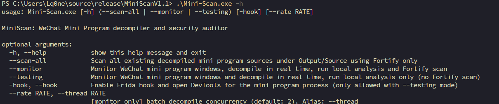
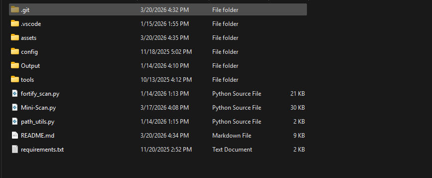
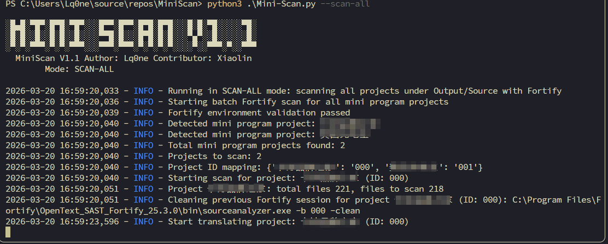
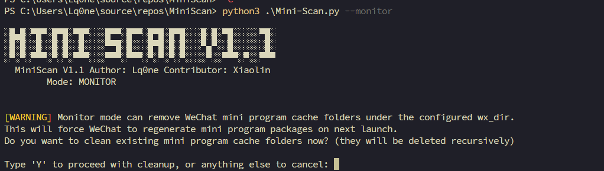
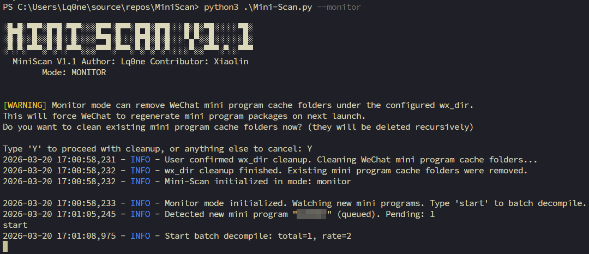
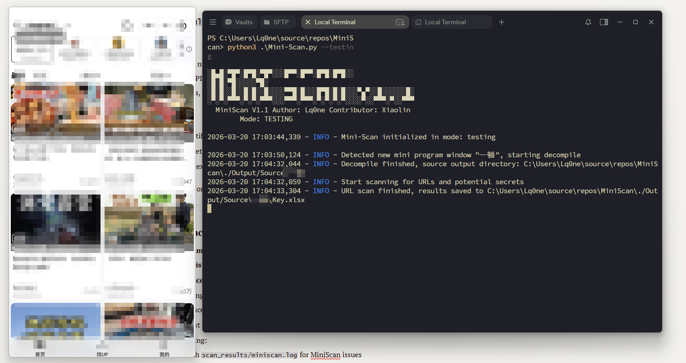

## MiniScan

MiniScan is a Windows tool that:

- **Decompiles WeChat mini programs** using an external unpacking tool (`KillWxapkg.exe`)
- **Scans the decompiled source** to extract URLs and potential secrets into Excel reports
- **Optionally runs Fortify SCA** to perform static security analysis on the decompiled source and generate FPR/PDF reports

MiniScan is designed to be packaged as a single `Mini-Scan.exe` via PyInstaller while keeping the `config` and `tools` folders external and editable.

---

## Directory Layout

At runtime (either from source or from the built exe), the working directory should look like:

- `Mini-Scan.exe` (or `Mini-Scan.py` when running from source)
- `config/`
  - `config.yaml` – main configuration (WeChat cache path, Fortify paths, etc.)
  - `rule.yaml` – regex rules for secrets / tokens / IDs
- `tools/`
  - `KillWxapkg.exe` – WeChat mini program unpack tool
  - `WeChatAppEx.exe.js` – Frida hook script
- `Output/`
  - `Source/` – mini program source folders for Fortify scanning
  - `Audit/` – Fortify FPR and PDF reports
  - `Log/` – Fortify log and summary files
- `scan_results/`
  - `miniscan.log` – MiniScan runtime log
- `result/`
  - One subfolder per decompiled mini program (source and Excel results)



---

## Installation & Build

### **Installation**

### 1.Install packaged MiniScan in [release page](https://github.com/Lq0ne/MiniScan/releases).

### 2. Configure Fortify (optional but recommended)

Edit `config/config.yaml`:

- Set `fortify_path` to your Fortify SCA installation path

```yaml
fortify_path: "C:\\Program Files\\Fortify\\OpenText_SAST_Fortify_25.3.0"
```

- Set `report_generator_path` to `ReportGenerator.bat`

```yaml
report_generator_path: "C:\\Program Files\\Fortify\\OpenText_Application_Security_Tools_25.2.0\\bin\\ReportGenerator.bat"
```

- Optionally adjust:
  - `max_worker` (default `1`)
  - `output_dir` (default `./Output/Audit`)

### 3. Configure WeChat mini program cache path

In `config/config.yaml`:

- Set `mini_scan.wx_dir` to the WeChat mini program cache directory, e.g.

```yaml
mini_scan:
  wx_dir: "C:\\Users\\<USER>\\AppData\\Roaming\\Tencent\\xwechat\\radium\\Applet\\packages"
```

MiniScan will monitor this directory to detect newly generated mini program packages.


### **Build: **

### 1. Python Environment

- Windows 10 or later (WeChat desktop client required)
- Python 3.9+ recommended
- Install dependencies:

```bash
pip install -r requirements.txt
```

### 2. Configure Fortify (optional but recommended)

Edit `config/config.yaml`:

- Set `fortify_path` to your Fortify SCA installation path

```yaml
fortify_path: "C:\\Program Files\\Fortify\\OpenText_SAST_Fortify_25.3.0"
```

- Set `report_generator_path` to `ReportGenerator.bat`

```yaml
report_generator_path: "C:\\Program Files\\Fortify\\OpenText_Application_Security_Tools_25.2.0\\bin\\ReportGenerator.bat"
```

- Optionally adjust:
  - `max_worker` (default `1`)
  - `output_dir` (default `./Output/Audit`)

### 3. Configure WeChat mini program cache path

In `config/config.yaml`:

- Set `mini_scan.wx_dir` to the WeChat mini program cache directory, e.g.

```yaml
mini_scan:
  wx_dir: "C:\\Users\\<USER>\\AppData\\Roaming\\Tencent\\xwechat\\radium\\Applet\\packages"
```

MiniScan will monitor this directory to detect newly generated mini program packages.

### 4. Build as a single EXE (optional)

PyInstaller spec (`Mini-Scan.spec`) is already provided and keeps `config` and `tools` as external folders:

```bash
pyinstaller Mini-Scan.spec
```

After build, copy or ensure:

- `config/` is next to `Mini-Scan.exe`
- `tools/` is next to `Mini-Scan.exe`

You can then edit `config.yaml` or replace tools in `tools/` without rebuilding the exe.

---

## Runtime Modes

MiniScan now supports **three mutually exclusive modes**:

- `--scan-all` – Fortify-only batch scan mode
- `--monitor` – Monitoring + decompile + local analysis + Fortify mode
- `--testing` – Monitoring + decompile + local analysis **without** Fortify

You **must** specify exactly one of these modes when starting MiniScan.

All modes have pretty formatting of decompiled code **enabled by default** (equivalent to `--pretty`).

---

## Usage

Basic usage from source:

```bash
python Mini-Scan.py --scan-all
python Mini-Scan.py --monitor
python Mini-Scan.py --testing
```

You can also combine with optional flags:

```bash
python Mini-Scan.py --monitor --hook
python Mini-Scan.py --testing --hook
```

### Global options

- `--hook` / `-hook`  
  Enable Frida hook to attach `WeChatAppEx.exe.js` and open DevTools for the mini program process.

- `--pretty` / `-pretty`  
  Enable pretty formatting for decompiled code.  
  Currently this is **enabled by default**; the flag is kept for compatibility.

### Required mode (pick exactly one)

- `--scan-all`  
  Run **Fortify SCA** on all existing mini program projects under `Output/Source`.  
  No WeChat monitoring or decompilation happens in this mode.

- `--monitor`  
  Monitor WeChat mini program windows, decompile each mini program in real time, run MiniScan local analysis (URLs/secrets), and then trigger Fortify batch scan.

- `--testing`  
  Same as `--monitor`, but **does not run Fortify**.  
  Useful when you only care about decompilation and local URL/secret reports.

---

## Mode Details & Workflow

**About first using, trying `--monitor` option is highly recommendation !**

### 1. `--scan-all` mode (Fortify-only batch scan)

Behavior:

- Does **not** monitor WeChat or decompile new mini programs
- Reads all project folders under `Output/Source`
- For each project:
  - Translates source into a Fortify session
  - Runs SCA with JavaScript / frontend rules
  - Produces:
    - `<project>.fpr` and `<project>.pdf` in `Output/Audit`
  - Logs progress and errors into `Output/Log/fortify_fortify.log`
- Generates a summary text report:  
  `Output/Log/min_code_scan_summary.txt`

Typical workflow:

1. Use `--monitor` or `--testing` to generate decompiled projects into `Output/Source`
2. Then run:

```bash
.\Mini-Scan.exe --scan-all
```



---

### 2. `--monitor` mode (monitor + decompile + scan)

Behavior:

- On start, shows a **warning** asking if you want to clean existing WeChat mini program cache folders under `mini_scan.wx_dir`
  - If you type `yes`, MiniScan will:
    - Recursively delete mini program cache directories (those starting with `wx` and length 18)
    - Log the cleanup result
  - If you skip, existing cache is kept
  
  
- Then continuously:
  - Watches `wx_dir` for new mini program folders until you type `start` and Enter.
  - For each newly opened mini program:
    - Identifies window title via `WeChatAppEx.exe`
    - Decompiles using `KillWxapkg.exe` into:
      - `result/<window_title_or_random_suffix>/`
    - Runs **local analysis** (`FileProcessor`):
      - Extracts URLs and URL paths
      - Applies regex rules from `config/rule.yaml` to find secrets/tokens
      - Writes Excel report `Key.xlsx` (or configured name) with:
        - URL list
        - Regex-based key findings
        - Optional async HTTP fuzz results (if enabled)
    - If running in `--monitor` mode:
      - Triggers `fortify_scan.main()` to scan all projects under `Output/Source`



Tips:

- Make sure WeChat is running and mini programs are opened normally
- Wait until the mini program UI is fully loaded before closing it, so the cache is complete

---

### 3. `--testing` mode (monitor + decompile, no Fortify)

Behavior:

- Same as `--monitor` for:
  - Watching new mini program windows
  - Decompiling with pretty formatting
  - Running local URL/secret extraction and Excel output
- **Does not** run Fortify scanning

Use `--testing` when:

- You are only validating decompilation behavior
- You only need the Excel results (`Key.xlsx`) and raw source under `result/`
- Fortify is not installed or not configured yet



---

## Result Files

- Decompilation output:
  - `result/<MiniProgramTitle>/` – decompiled source tree
  - `result/<MiniProgramTitle>/Key.xlsx` – URL/secret scan result

- Fortify output (for `--scan-all` or `--monitor`):
  - `Output/Source/<MiniProgramTitle>/` – source to scan
  - `Output/Audit/<MiniProgramTitle>.fpr` – Fortify project result
  - `Output/Audit/<MiniProgramTitle>.pdf` – Fortify PDF report
  - `Output/Log/fortify_fortify.log` – detailed Fortify logs
  - `Output/Log/min_code_scan_summary.txt` – batch summary

- Logs:
  - `scan_results/miniscan.log` – MiniScan runtime log

---

## Configuration Files

### `config/config.yaml`

Contains:

- `mini_scan` section – WeChat, async HTTP, thread, and decompile settings
- `fortify_scan` section – Fortify installation paths and performance knobs

Comments in the file explain each key and are fully in English.

### `config/rule.yaml`

Defines regex rules for:

- Emails, phone numbers, ID cards
- JWT tokens, API keys for multiple cloud providers
- Webhook URLs, private keys, passwords, authorization headers, etc.

Each rule has:

- `id` – rule identifier (used in Excel output)
- `enabled` – whether the rule is active
- `pattern` – regex pattern string

You can enable/disable or customize rules as needed.

---

## Notes & Best Practices

- **Run as the same user** who runs WeChat, so MiniScan can access the correct cache path
- **Before use this tool in `--monitor`, ensure all the Mini Programs have closed!!!**
- **Always keep `config/` and `tools/` next to the exe** after packaging
- When upgrading tools:
  - Replace binaries/scripts under `tools/`
  - Adjust `mini_scan.unpack_tool` and other paths if necessary
- When debugging:
  - Watch `scan_results/miniscan.log` for MiniScan issues
  - Watch `Output/Log/fortify_fortify.log` for Fortify issues
